# MVP 3 — Construção de um Pipeline de Dados na Nuvem
## Forecasting de Demanda em S&OP: da Análise ao Pipeline Produtivo

Este repositório contém os notebooks e a documentação do pipeline de dados construído no Databricks Free Edition, dando continuidade ao trabalho iniciado nos MVPs 1 (Análise de Dados) e 2 (Machine Learning & Analytics), agora estruturado como um pipeline de engenharia de dados na nuvem, seguindo a Arquitetura Medalhão (Bronze → Silver → Gold).

**Nome:** Thiago Dias Paes Reis | **Matrícula:** 4052026000111
**Plataforma:** Databricks Free Edition (Unity Catalog)


**Repositório MVP 1:** [https://github.com/thiago-dias-paes/MVPAnalisedeDadoseBoasPraticas/tree/main]


**Repositório MVP 2:** [https://github.com/thiago-dias-paes/MVPMachineLearning-Analytics]

## Repositório
├── 00_arquitetura_pipeline.ipynb
├── 01_bronze_ingestao.ipynb
├── 02_silver_limpeza.ipynb
├── 03_silver_indices_e_clusters.ipynb
├── 04_gold_dimensoes_e_fato.ipynb
├── 05_gold_forecast.ipynb
├── 06_qualidade_dados.ipynb
├── 07_analise_perguntas_negocio.ipynb
├── evidencias/ → screenshots do pipeline em execução 
└── README.md

---

## Contexto de Negócios e Perguntas (Etapas 2 e 4.1)

Os MVPs 1 e 2 restringiram a análise à Loja 1, identificando 2 famílias de modelagem sazonal (K-Means) e validando estatisticamente o Holt-Winters como modelo vencedor de forecasting. Este MVP expande esse raciocínio para as **10 lojas** do dataset, empacotado como um pipeline reprodutível na nuvem.

**Perguntas de negócio:**
1. Os clusters sazonais da Loja 1 se replicam nas demais lojas?
2. Qual a distribuição de volume por loja e cluster?
3. Existe correlação entre cluster sazonal e algum perfil de loja?
4. Qual o percentual de itens com histórico esparso, por loja?
5. O Holt-Winters mantém superioridade sobre o baseline Naive Sazonal em escala?
6. Qual a qualidade dos dados brutos, agora nas 10 lojas?

**Dataset:** Store Item Demand Forecasting Challenge — Kaggle. 913.000 registros diários, 10 lojas × 50 itens, 2013–2017. Licença: uso educacional/não comercial (Kaggle Competition Rules).

---

## Carga dos Dados (Etapa 4.2)

O `train.csv` foi enviado via upload manual para um Volume do Unity Catalog (`bronze.sop_forecast.raw_files`) e ingerido como tabela Delta pelo notebook [`01_bronze_ingestao.ipynb`](./01_bronze_ingestao.ipynb), com metadados de controle (`_ingestion_ts`, `_fonte`). Resultado: 913.000 linhas — volume idêntico ao validado nos MVPs anteriores.

📸 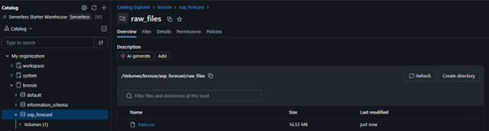
📸 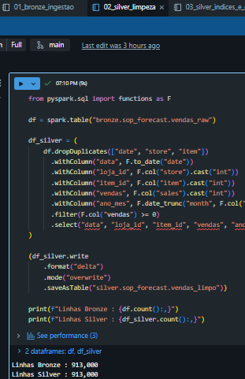

---

## Modelagem e Catálogo de Dados (Etapa 4.3)

Esquema Estrela na camada Gold, com uma decisão de modelagem central: como `cluster_id` e `mix_pct` dependem da combinação loja+item (cada loja tem seu próprio K-Means), esses atributos foram isolados em uma **tabela ponte** (`dim_item_loja`), evitando violar a granularidade da dimensão `dim_item`.

📸 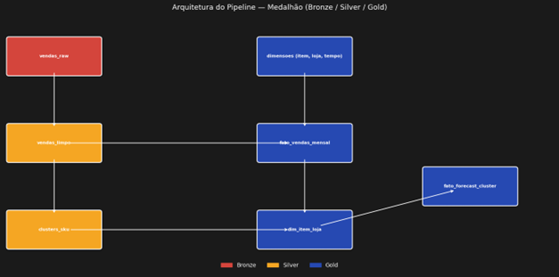

| Tabela | Camada | Colunas principais | Descrição |
|---|---|---|---|
| `vendas_raw` | Bronze | date, store, item, sales | Cópia fiel do CSV original |
| `vendas_limpo` | Silver | data, loja_id, item_id, vendas, ano_mes | Dados tipados e validados |
| `clusters_sku` | Silver | loja_id, item_id, cluster_id | Cluster sazonal (K=2), calculado por loja |
| `dim_tempo` | Gold | ano_mes, ano, mes, trimestre | Dimensão de calendário |
| `dim_loja` | Gold | loja_id, nome_loja | Dimensão de loja |
| `dim_item` | Gold | item_id, nome_item | Dimensão de item |
| `dim_item_loja` | Gold | loja_id, item_id, cluster_id, mix_pct | Tabela ponte: cluster e participação no volume |
| `fato_vendas_mensal` | Gold | loja_id, item_id, ano_mes, vendas_mes | Fato de vendas agregadas |
| `fato_forecast_cluster` | Gold | loja_id, cluster_id, ano_mes, real, pred_naive, pred_hw, mape_naive, mape_hw | Fato de previsão por cluster |

📸 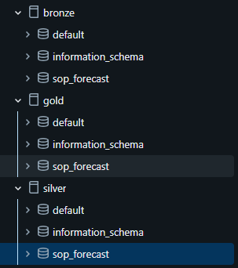

---

## Pipeline de Dados (Etapa 4.4)

O pipeline foi ramificado em 7 notebooks, um por responsabilidade:

| Notebook | Camada | Função |
|---|---|---|
| [`01_bronze_ingestao`](./01_bronze_ingestao.ipynb) | Bronze | Ingestão do CSV bruto |
| [`02_silver_limpeza`](./02_silver_limpeza.ipynb) | Silver | Tipagem, deduplicação, filtro |
| [`03_silver_indices_e_clusters`](./03_silver_indices_e_clusters.ipynb) | Silver | Índices sazonais + K-Means por loja |
| [`04_gold_dimensoes_e_fato`](./04_gold_dimensoes_e_fato.ipynb) | Gold | Dimensões, tabela ponte e fato |
| [`05_gold_forecast`](./05_gold_forecast.ipynb) | Gold | Forecast Naive vs. Holt-Winters |
| [`06_qualidade_dados`](./06_qualidade_dados.ipynb) | — | Verificações de qualidade |
| [`07_analise_perguntas_negocio`](./07_analise_perguntas_negocio.ipynb) | — | Respostas às perguntas de negócio |

O modelo Holt-Winters foi aplicado diretamente na camada Gold **sem reabrir comparação com modelos de Machine Learning** (ex: XGBoost) — essa comparação já foi feita e validada estatisticamente no MVP2 (Wilcoxon, p<0.001, N=365 pares), mantendo o escopo deste MVP focado em engenharia de dados, não em nova investigação de modelagem.

📸 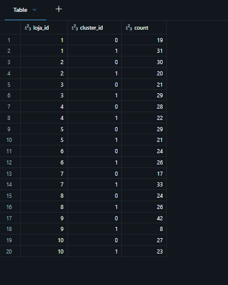
📸 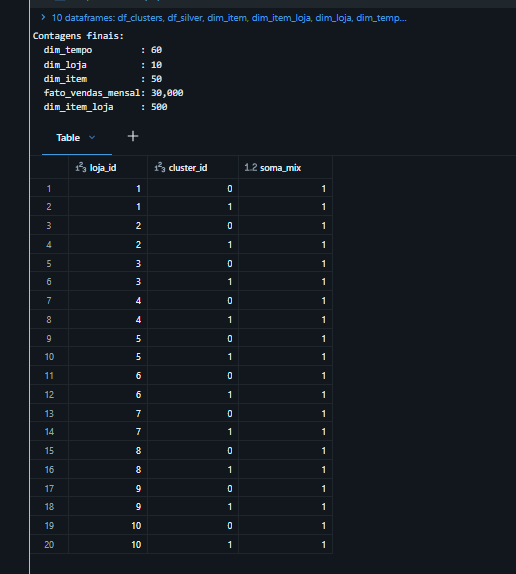
📸 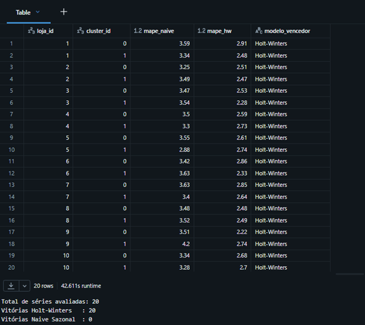

### Validação da camada Gold via SQL

Como reforço final, a camada Gold foi validada diretamente via SQL Editor, sem depender do ambiente Python/PySpark — confirmando que os dados estão de fato prontos para consumo analítico padrão, como previsto pela Arquitetura Medalhão:

```
SELECT l.nome_loja, f.ano_mes, SUM(f.vendas_mes) AS total_vendas
FROM gold.sop_forecast.fato_vendas_mensal f
JOIN gold.sop_forecast.dim_loja l ON f.loja_id = l.loja_id
GROUP BY l.nome_loja, f.ano_mes
ORDER BY f.ano_mes DESC
LIMIT 10;
```

```
SELECT loja_id, cluster_id, mape_naive, mape_hw, modelo_vencedor
FROM gold.sop_forecast.fato_forecast_cluster
GROUP BY loja_id, cluster_id, mape_naive, mape_hw, modelo_vencedor
ORDER BY loja_id, cluster_id;
```

📸 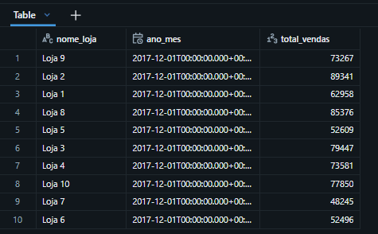
📸 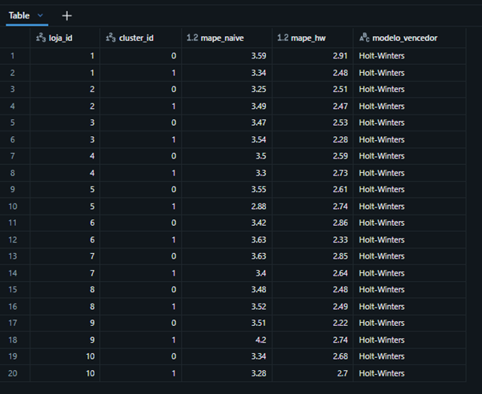

Scripts completos: [`/`](.) (raiz do repositório)

---

## Qualidade de Dados (Etapa 4.5)

| Verificação | Resultado |
|---|---|
| Completude (nulos) | 0 em todas as colunas |
| Unicidade (duplicatas) | 0 |
| Consistência (domínios) | store 1–10, item 1–50, datas 2013–2017 ok |
| Acurácia (vendas negativas) | 0 |
| Outliers (acima do p99.9 = 231 un.) | 0 (0,000%) |
| Completude estrutural | 913.000 esperado = 913.000 real (gap = 0) |
| Histórico esparso (>10% meses zerados) | 0 de 500 combinações loja-item |

Dataset íntegro nas 10 lojas — nenhum tratamento corretivo foi necessário.

📸 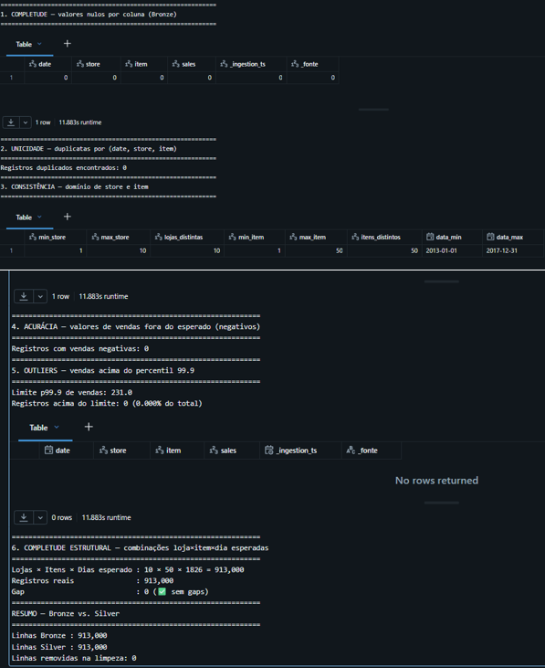

---

## Análise de Dados (Etapa 4.5)

**P1 — Os clusters se replicam entre lojas?**
Não confirmada. A concordância bruta (52%–66% vs. Loja 1) parecia indicar similaridade, mas ao corrigir pelo acaso via Adjusted Rand Index (matriz 10×10 entre todas as lojas), os valores caíram para próximo de zero (-0,02 a 0,08) — estatisticamente equivalente a atribuição aleatória. Conclui-se que cada loja possui estrutura sazonal própria.

**P2 — Distribuição de volume por loja e cluster**
Respondida. Grande heterogeneidade entre lojas — ex: Loja 9 com desequilíbrio extremo (4,4M vs. 0,6M un.), Loja 8 mais equilibrada.

**P3 — Correlação entre cluster e perfil de loja**
Não é possível responder com atributos externos (o dataset não os fornece). Uma tentativa via meta-clustering (mesma técnica da P1) também não encontrou padrão. Pergunta registrada como não respondida — ver Autoavaliação.

**P4 — Itens com histórico esparso**
Confirmada. 0 de 500 combinações loja-item têm mais de 10% de meses zerados — reforça, em escala, a premissa de viabilidade da modelagem por família do MVP1.

**P5 — Holt-Winters supera o Naive Sazonal em escala?**
Confirmada. 20/20 combinações loja×cluster favoreceram o Holt-Winters (MAPE médio ≈ 2,6% vs. ≈ 3,5% do Naive), consistente com o MVP2.

**P6 — Qualidade dos dados nas 10 lojas**
Confirmada — ver seção anterior.

📸 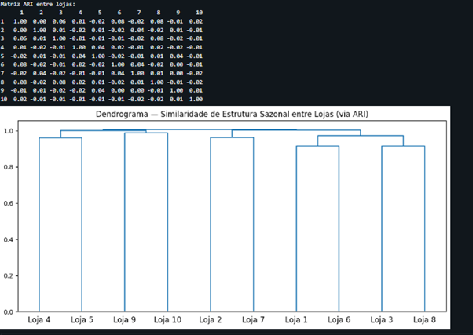
📸 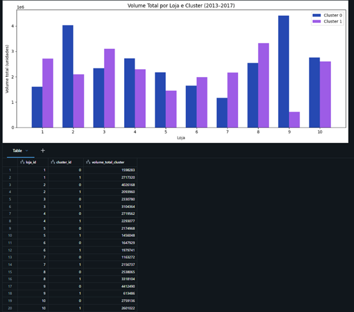

---

## Autoavaliação

O objetivo inicial deste MVP era estruturar um pipeline de dados na nuvem que replicasse, em escala (10 lojas), o raciocínio analítico desenvolvido nos MVPs 1 e 2. Esse objetivo foi atingido: o pipeline completo (Bronze → Silver → Gold) está funcional, documentado e versionado, com tabelas dimensionais consistentes e um catálogo de dados detalhado.

Das 6 perguntas de negócio propostas, 4 foram respondidas de forma conclusiva (P2, P4, P5, P6) e 2 tiveram resposta negativa honesta (P1, P3) — o que é considerado tão valioso quanto uma confirmação, na medida em que evita conclusões infundadas. Em particular, o processo de responder P1 revelou uma armadilha metodológica real: uma métrica de concordância bruta sugeria similaridade entre lojas, mas, ao aplicar uma correção estatística pelo acaso (Adjusted Rand Index), ficou claro que esse sinal era artefato do desbalanceamento dos clusters, não um padrão genuíno. É preferível reportar esse resultado corrigido — mesmo sendo menos interessante à primeira vista — a manter uma conclusão estatisticamente frágil.

A maior dificuldade técnica encontrada foi a curva de aprendizado inicial com o Databricks, ferramenta não utilizada anteriormente (os MVPs anteriores foram desenvolvidos inteiramente em Google Colab). Conceitos como Unity Catalog, Volumes, e a diferença entre catálogos/schemas/tabelas exigiram um tempo de adaptação que não existia no fluxo anterior — porém, uma vez compreendida a lógica, o processo de construção do pipeline propriamente dito fluiu de forma natural, apoiado na base analítica já consolidada nos MVPs 1 e 2.

**Trabalhos futuros:**
- Obter metadados reais de loja (região, porte) para testar a Pergunta 3 de forma robusta, com dados externos em vez de inferência interna
- Automatizar a execução do pipeline via Databricks Jobs, simulando uma atualização mensal real de S&OP
- Incorporar variáveis exógenas (feriados, promoções) na camada de forecast
- Investigar por que a estrutura sazonal não se replica entre lojas — a ausência de padrão pode indicar variação real de comportamento de consumo, e não apenas ruído estatístico, o que mereceria uma análise dedicada

---

## Técnicas Utilizadas

**Engenharia de Dados**
- Arquitetura Medalhão (Bronze/Silver/Gold) via Unity Catalog
- Modelagem dimensional (Esquema Estrela com tabela ponte)
- ETL em PySpark, com tabelas Delta
- Consultas de validação via SQL Editor

**Análise**
- Clustering K-Means (herdado do MVP1, replicado por loja)
- Adjusted Rand Index para comparação de agrupamentos entre lojas
- Clustering hierárquico (average linkage) para meta-análise de similaridade entre lojas
- Forecasting com Holt-Winters vs. baseline Naive Sazonal (modelo validado estatisticamente no MVP2)

## Dataset
Store Item Demand Forecasting Challenge — Kaggle
913.000 registros diários | 10 lojas × 50 itens × 5 anos (2013–2017)
🔗 https://www.kaggle.com/c/demand-forecasting-kernels-only
